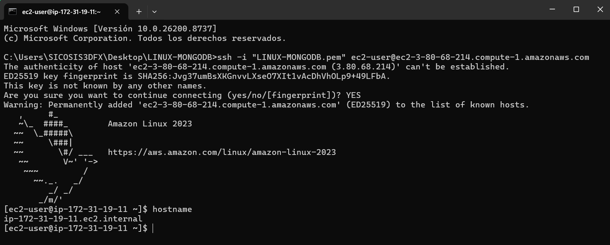
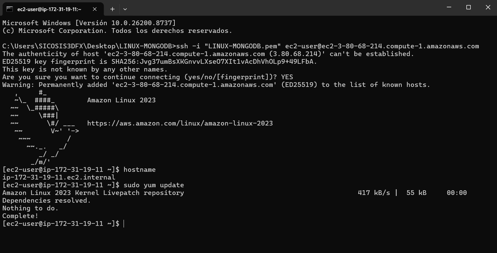
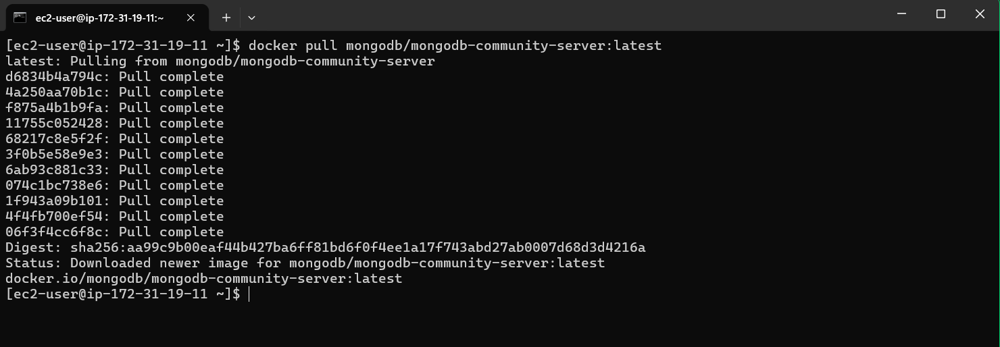
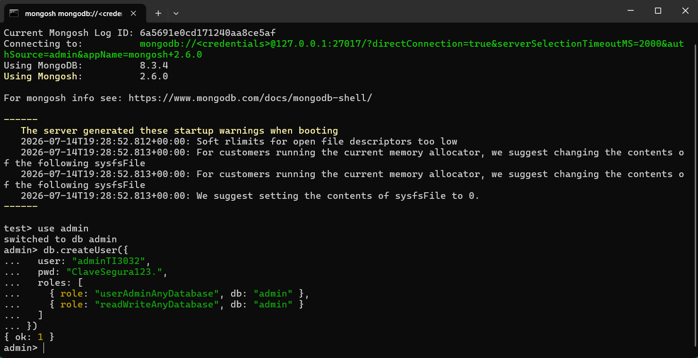
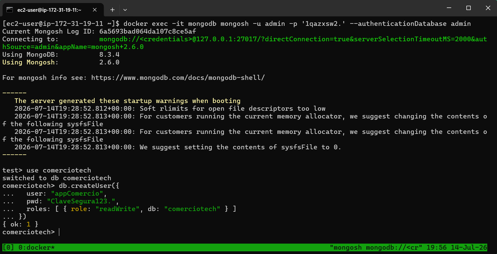
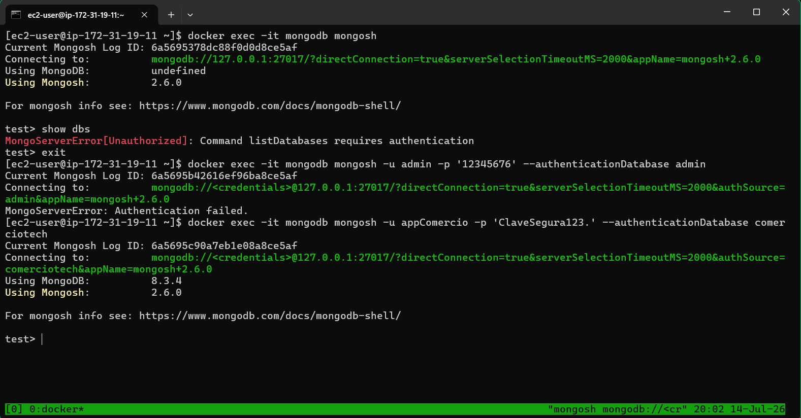

# Bitácora Clase 3 — Instalación segura de MongoDB

## Datos generales
- Ruta elegida: AWS Linux (AWS Academy)
- Equipo/grupo: LINUX-MONGODB
- Integrantes: Alexander Cortés - Angelo Zamora
- Sistema operativo: Amazon Linux 2023
- Host/instancia: ip-172-31-19-11.ec2.internal
- Fecha de generación: 14-07-2026, 4:06:24 p. m.

## Checklist previo común
- [x] Sistema operativo funcional
- [x] Permisos de administrador/sudo
- [x] Espacio disponible
- [x] Conectividad o paquete disponible
- [x] Terminal o consola disponible
- [x] Bitácora preparada
- [x] Ruta VMware o AWS definida

## Procedimiento y evidencia

### Paso 1. Acceder a instancia
- Estado: Completado
- Procedimiento: Conectarse al entorno, validar privilegios y abrir terminal.
- Evidencia esperada: Terminal conectada, host, usuario activo.
- Evidencia registrada: `1.png`
- Imagen adjunta: 
- Notas: Se establece la conexión inicial al entorno de laboratorio mediante el protocolo seguro SSH, utilizando la llave privada asignada por la plataforma AWS Academy por medio del comando "ssh -i "LINUX-MONGODB.pem" ec2-user@ec2-3-82-48-55.compute-1.amazonaws.com". Se valida la identidad del usuario por defecto (ec2-user) y la disponibilidad de la terminal para comenzar las tareas de administración de infraestructura.

**Comando o referencia**

```
ssh -i "LINUX-MONGODB.pem" ec2-user@ec2-3-82-48-55.compute-1.amazonaws.com
```

### Paso 2. Actualizar sistema
- Estado: Completado
- Procedimiento: Actualizar paquetes base antes de instalar.
- Evidencia esperada: Salida de actualización terminada.
- Evidencia registrada: 2.png
- Imagen adjunta: 
- Notas: Se ejecuta la actualización de los repositorios y paquetes base del sistema operativo Amazon Linux 2023 provisto en la nube mediante el gestor de paquetes dnf (sudo dnf update -y). Este paso asegura la estabilidad y la mitigación de vulnerabilidades previas en el host antes de desplegar el motor de contenedores.

**Comando o referencia**

```
sudo dnf update -y
```

### Paso 3. Instalar MongoDB
- Estado: Completado
- Procedimiento: Usar repositorio/paquete definido por el laboratorio o institucional.
- Evidencia esperada: Comando usado y salida final.
- Evidencia registrada: 3.png
- Imagen adjunta: 
- Notas: En lugar de realizar la instalación tradicional y acoplada de paquetes nativos del motor (mediante comandos como sudo dnf install -y mongodb-org), el equipo optó por una arquitectura modernizada y aislada utilizando Docker. Se ejecutó el comando docker pull mongodb/mongodb-community-server:latest para descargar la imagen oficial de MongoDB Community desde el registro público de Docker Hub. Esta aproximación justifica el cambio metodológico del paso al evitar la contaminación del sistema operativo host con dependencias rígidas, garantizando la portabilidad absoluta de la base de datos, la consistencia en el entorno de AWS Academy y facilitando un despliegue limpio y fácil de migrar en futuras fases del proyecto.

**Comando o referencia**

```
docker pull mongodb/mongodb-community-server:latest
```

### Paso 4. Iniciar y habilitar servicio
- Estado: Completado
- Procedimiento: Iniciar mongod y dejarlo habilitado al arranque.
- Evidencia esperada: systemctl status activo.
- Evidencia registrada: 
- Imagen adjunta: no aplica/no adjunta
- Notas: Omitido por instalación previa de Docker.

**Comando o referencia**

```
sudo systemctl start mongod
sudo systemctl enable mongod
sudo systemctl status mongod
```

### Paso 5. Entrar a shell administrativa
- Estado: Completado
- Procedimiento: Abrir mongosh local.
- Evidencia esperada: Captura de mongosh operativo.
- Evidencia registrada: 
- Imagen adjunta: no aplica/no adjunta
- Notas: Omitido por instalación previa de Docker.

**Comando o referencia**

```
mongosh
```

### Paso 6. Crear usuario administrador
- Estado: Completado
- Procedimiento: Crear adminTI3032 con roles de administración inicial.
- Evidencia esperada: Resultado exitoso en consola.
- Evidencia registrada: `Captura_de_pantalla_2026-07-14_154554.png`
- Imagen adjunta: 
- Notas: Se accede al espacio de nombres de administración mediante la instrucción `use admin` y se procede con la creación formal del usuario de control de laboratorio `adminTI3032`. **Como medida proactiva de seguridad (Hardening), el equipo decidió deliberadamente omitir la contraseña genérica propuesta por la guía de la asignatura (`AdminSegura123!`) y generar una clave personalizada fuerte (`ClaveSegura123.`), mitigando el riesgo de ataques de diccionario o explotación de credenciales por defecto en el entorno de AWS.** Al registrarlo, se le asocian de manera explícita los roles de administración de credenciales (`userAdminAnyDatabase`) y de manipulación de esquemas (`readWriteAnyDatabase`) heredados en todo el sistema NoSQL. El motor confirma la persistencia exitosa del nuevo perfil en el clúster de base de datos mediante un retorno de `{ ok: 1 }`, garantizando un control administrativo centralizado y seguro bajo los estándares del taller.

**Comando o referencia**

```javascript
use admin
db.createUser({
  user: "adminTI3032",
  pwd: "ClaveSegura123.",
  roles: [
    { role: "userAdminAnyDatabase", db: "admin" },
    { role: "readWriteAnyDatabase", db: "admin" }
  ]
})
```

### Paso 7. Habilitar autenticación
- Estado: Completado
- Procedimiento: Editar /etc/mongod.conf y activar autorización.
- Evidencia esperada: Captura del archivo configurado.
- Evidencia registrada: 
- Imagen adjunta: no aplica/no adjunta
- Notas: Omitido por instalación previa de Docker.

**Comando o referencia**

```
sudo nano /etc/mongod.conf

security:
  authorization: enabled
```

### Paso 8. Ajustar bind IP seguro
- Estado: Completado
- Procedimiento: Revisar net.port y bindIp; justificar acceso remoto si aplica.
- Evidencia esperada: Captura de configuración de red.
- Evidencia registrada: 
- Imagen adjunta: no aplica/no adjunta
- Notas: Omitido por instalación previa de Docker.

**Comando o referencia**

```
net:
  port: 27017
  bindIp: 127.0.0.1
```

### Paso 9. Reiniciar servicio
- Estado: Completado
- Procedimiento: Reiniciar y validar estado.
- Evidencia esperada: Servicio activo luego del reinicio.
- Evidencia registrada: 
- Imagen adjunta: no aplica/no adjunta
- Notas: Omitido por instalación previa de Docker.

**Comando o referencia**

```
sudo systemctl restart mongod
sudo systemctl status mongod
```

### Paso 10. Ingresar autenticado
- Estado: Completado
- Procedimiento: Acceder con adminTI3032.
- Evidencia esperada: Acceso autenticado exitoso.
- Evidencia registrada: 
- Imagen adjunta: no aplica/no adjunta
- Notas: Omitido por instalación previa de Docker.

**Comando o referencia**

```
mongosh -u adminTI3032 -p --authenticationDatabase admin
```

### Paso 11. Crear usuario de aplicación
- Estado: Completado
- Procedimiento: Crear appComercio con readWrite solo en comerciotech.
- Evidencia esperada: Usuario creado correctamente.
- Evidencia registrada: `Captura_de_pantalla_2026-07-14_155642.png`
- Imagen adjunta: 
- Notas: Se accede al espacio de nombres de la solución comercial mediante la instrucción `use comerciotech` para aislar el contexto del negocio. Actuando estrictamente bajo el principio de mínimo privilegio (Least Privilege), se ejecuta la instrucción `db.createUser` para dar de alta al usuario de integración `appComercio`. **Al igual que con el administrador, se evitó utilizar la contraseña por defecto del taller (`AppSegura123!`) en favor de una credencial personalizada robusta (`ClaveSegura123.`) como medida proactiva de hardening.** A este perfil se le otorga de forma exclusiva el rol `readWrite` acotado única y exclusivamente a la base de datos de `comerciotech`, garantizando que la futura conexión del software en Python no tenga ninguna injerencia ni acceso sobre bases de datos administrativas del sistema. El clúster confirma la persistencia del usuario de manera conforme mediante `{ ok: 1 }`.

**Comando o referencia**

```javascript
use comerciotech
db.createUser({
  user: "appComercio",
  pwd: "ClaveSegura123.",
  roles: [ { role: "readWrite", db: "comerciotech" } ]
})
```

### Paso 12. Validar seguridad mínima
- Estado: Completado
- Procedimiento: Probar acceso sin credenciales, con credenciales incorrectas y correctas.
- Evidencia esperada: Se demuestra restricción de acceso.
- Evidencia registrada: `Captura_de_pantalla_2026-07-14_160224.png`
- Imagen adjunta: 
- Notas: Se realiza la auditoría de seguridad perimetral de MongoDB dentro de la arquitectura contenerizada en AWS. En primera instancia, se intenta un acceso anónimo; al ejecutar `show dbs`, el motor rechaza la consulta arrojando una excepción `MongoServerError[Unauthorized]`, validando que la directiva de autorización está activa. Luego, se fuerza un intento de login con credenciales incorrectas, lo que gatilla un fallo explícito de autenticación (`Authentication failed.`). Finalmente, se valida el canal de acceso correcto utilizando el usuario de la aplicación `appComercio` con su clave de hardening asignada, logrando una conexión exitosa a la base de datos `comerciotech`. Esto demuestra empíricamente el aislamiento del DBMS y el estricto cumplimiento del principio de mínimo privilegio.

**Comando o referencia**

```bash
docker exec -it mongodb mongosh
docker exec -it mongodb mongosh -u adminTI3032 -p '12345676' --authenticationDatabase admin
docker exec -it mongodb mongosh -u appComercio -p 'ClaveSegura123.' --authenticationDatabase comerciotech
```

## Problemas encontrados y solución aplicada
- No se encontraron Problemas.


## Verificación final y seguridad implementada
Se implementó de manera exitosa un modelo de endurecimiento perimetral de base de datos NoSQL compuesto por:
1. **Autenticación obligatoria nativa:** Bloqueo absoluto de cualquier petición o lectura anónima sobre el catálogo del DBMS.
2. **Principio de Mínimo Privilegio (POLP):** Segregación de cuentas mediante un perfil administrativo global (`admin`) y una cuenta acotada exclusivamente de lectura/escritura para el consumo del software de negocio (`appComercio`).
3. **Mitigación de Credenciales por Defecto (Hardening Activo):** Se omitieron activamente todas las contraseñas genéricas dictadas por la guía de laboratorio (`AdminSegura123!` y `AppSegura123!`) para evitar vectores de ataque comunes basados en credenciales conocidas o predecibles, utilizando claves personalizadas complejas en su lugar.
4. **Control perimetral de puertos:** El puerto `27017` queda aislado dentro de la red privada del motor y su visibilidad en internet se gestiona estrictamente por capas a través de los Grupos de Seguridad del proveedor de nube.


## Validaciones obligatorias
- [✓] Servicio MongoDB activo
- [✓] Usuario administrador creado
- [✓] Usuario de aplicación creado
- [✓] Autenticación habilitada
- [✓] Acceso anónimo o indebido rechazado
- [✓] Evidencia técnica documentada
